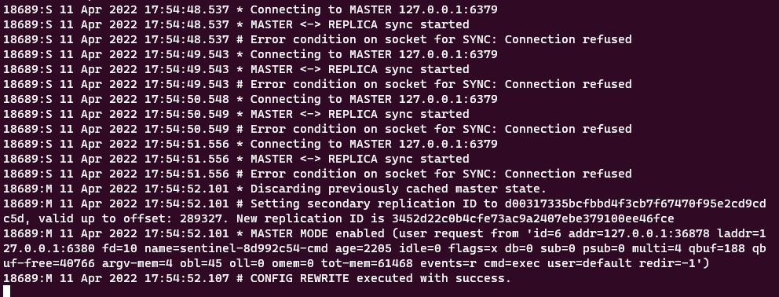
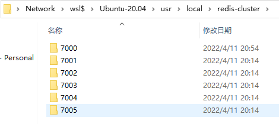

Week12 作业题目：

### 1.（必做）配置 redis 的主从复制，sentinel 高可用，Cluster 集群。
####配置文件：
https://github.com/lushangyan/JavaHomeWork/blob/95c95fe5c6ae256fc2912d27efe82280d4cef92b/week12/conf

####Redis主从复制：从单机到多节点  ~mysql主从

配置文件redis6379.conf,redis6380.conf（需要重点关注的配置）
- 端口
  - port 6379
  - port 6380
- 数据文件夹(为了将两个配置文件的数据隔离开)：
  - dir "/Users/lushangyan/logs/redis0"
  - dir "/Users/lushangyan/logs/redis1"`
- pid文件
  - pidfile "/var/run/redis_6379.pid"
  - pidfile "/var/run/redis_6378.pid"

配置从节点：slaveof localhost 6379

实践：
- 启动server： ./redis-server redis6379.conf
- 启动server： ./redis-server redis6380.conf
- 客户端：./redis-cli -p 6379
- 客户端：./redis-cli -p 6380
- 将6380变成6379从节点：
  - 127.0.0.1:6380> slaveof localhost 6379
- 6380执行info查看节点信息：
```` text
  role:slave
  master_host:localhost
  master_port:6379
````
- 6379执行info查看节点信息：
```` text
  role:master
  connected_slaves:1
```` 
####Redis Sentinel主从切换（哨兵）：走高可用-MHA

配置文件redis6379.conf,redis6380.conf
- 主节点master是哪个 sentinel选举需要最少的集群投票是几个
  - sentinel monitor mymaster 127.0.0.1 6380 2
  - 监听redis做选举状态的时间  心跳检测窗口 默认60000
  - sentinel down-after-milliseconds mymaster 10000
  - failover最大时间三分钟 三分钟内sentinel选举设置新的主库，如果失败了，会在去找一个
  - 和上面的参数(sentinel down-after-milliseconds mymaster)组合起来意味着redis主从切换的频率
  - sentinel failover-timeout mymaster 180000
  - 从库从主库同步拉数据，可以并行几个
  - entinel parallel-syncs mymaster 1

两种启动方式：
- redis-sentinel sentinel.conf
- redis-server redis.conf --sentinel 

实践：
- 在主从复制配置和运行的基础上
- 启动sentinel：./redis-sentinel sentinel0.conf、redis-sentinel sentinel1.conf
- 将6379master停掉，测试6380选举成主节点
- 6380选举成主节点，6380控制台输出

- 6380执行info：
```` text
  role:master
  connected_slaves:0
````
- 重新启动6079，info查看信息，6379成为6380从库，并且开始同步数据
```` text
  role:slave
  master_host:127.0.0.1
  master_port:6380
````

####Redis Cluster:走向分片~全自动分片

实践：
- 创建文件夹
````text
    mkdir -p /usr/software/redis/redis-cluster/{7000, 7001, 7002, 7003, 7004, 7005}
    mkdir -p /usr/software/redis/redis-cluster/7000/{log, data}
````


- 配置文件:D:\Develop\IdeaProjects\JavaHomeWork\week12\redis-cluster\7000\redis.conf
- redis.conf :
```` text
    ####### NETWORK #####################################
    bind 127.0.0.1 -::1
    protected-mode yes
    port 7000
    ####### GENERAL ######################################
    daemonize yes
    pidfile "/var/run/redis_7000.pid"
    logfile "/usr/local/redis-cluster/7000/log/redis.log"
    ####### SNAPSHOTTING  ################################
    dir "/usr/local/redis-cluster/7000/data"
    ####### REDIS CLUSTER  ###############################
    cluster-enabled yes
    cluster-config-file nodes-7000.conf
    cluster-node-timeout 15000
```` 
- 将配置文件放到7000-7005中进行修改
- 集群启动--启动6个节点
```` text
    root@DESKTOP-DQCRUJH:/usr/local/redis/bin# ./redis-server /usr/local/redis-cluster/7000/redis.conf
    root@DESKTOP-DQCRUJH:/usr/local/redis/bin# ./redis-server /usr/local/redis-cluster/7001/redis.conf
    root@DESKTOP-DQCRUJH:/usr/local/redis/bin# ./redis-server /usr/local/redis-cluster/7002/redis.conf
    root@DESKTOP-DQCRUJH:/usr/local/redis/bin# ./redis-server /usr/local/redis-cluster/7003/redis.conf
    root@DESKTOP-DQCRUJH:/usr/local/redis/bin# ./redis-server /usr/local/redis-cluster/7004/redis.conf
    root@DESKTOP-DQCRUJH:/usr/local/redis/bin# ./redis-server /usr/local/redis-cluster/7005/redis.conf
```` 
- 查看进程
```` text
    root@DESKTOP-DQCRUJH:/usr/local/redis/bin# ps -ef|grep redis
    root     19446 18279  0 20:51 ?        00:00:00 ./redis-server 127.0.0.1:7000 [cluster]
    root     19452 18279  0 20:51 ?        00:00:00 ./redis-server 127.0.0.1:7001 [cluster]
    root     19458 18279  0 20:51 ?        00:00:00 ./redis-server 127.0.0.1:7002 [cluster]
    root     19464 18279  0 20:51 ?        00:00:00 ./redis-server 127.0.0.1:7003 [cluster]
    root     19470 18279  0 20:51 ?        00:00:00 ./redis-server 127.0.0.1:7004 [cluster]
    root     19476 18279  0 20:51 ?        00:00:00 ./redis-server 127.0.0.1:7005 [cluster]
    root     19624 18280  0 20:58 pts/0    00:00:00 grep --color=auto redis
```` 
- 创建redis集群。创建集群命令：其中--cluster-replicas 1代表 一个master后有几个slave，1代表为1个slave节点
```` text
./redis-cli --cluster create 127.0.0.1:7000  127.0.0.1:7001 127.0.0.1:7002 127.0.0.1:7003 127.0.0.1:7004 127.0.0.1:7005 --cluster-replicas 1
````
- 过程中出现确认提示，输入yes即可
```` text
    >>> Performing hash slots allocation on 6 nodes...
    Master[0] -> Slots 0 - 5460
    Master[1] -> Slots 5461 - 10922
    Master[2] -> Slots 10923 - 16383
    Adding replica 127.0.0.1:7004 to 127.0.0.1:7000
    Adding replica 127.0.0.1:7005 to 127.0.0.1:7001
    Adding replica 127.0.0.1:7003 to 127.0.0.1:7002
    >>> Trying to optimize slaves allocation for anti-affinity
    [WARNING] Some slaves are in the same host as their master
    M: d8e98f494cc78c1a14cc1b8a628bc336252c2b73 127.0.0.1:7000
    slots:[0-5460] (5461 slots) master
    M: 0196cb03111bbf850c04505c2a1643b995d2587c 127.0.0.1:7001
    slots:[5461-10922] (5462 slots) master
    M: 1d92aff0fc015ad2f41197e3c53a88144fbd54b7 127.0.0.1:7002
    slots:[10923-16383] (5461 slots) master
    S: 1d92aff0fc015ad2f41197e3c53a88144fbd54b7 127.0.0.1:7003
    replicates 1d92aff0fc015ad2f41197e3c53a88144fbd54b7
    S: 39ec33806ab3f9ed8f88a1e72f13ca6dd000b4e3 127.0.0.1:7004
    replicates d8e98f494cc78c1a14cc1b8a628bc336252c2b73
    S: f2f3bfae8466873429cfb8ed68c51f4448e3017c 127.0.0.1:7005
    replicates 0196cb03111bbf850c04505c2a1643b995d2587c
    Can I set the above configuration? (type 'yes' to accept):
```` 
- 集群自动分配结果如下：
```` text
    >>> Nodes configuration updated
    >>> Assign a different config epoch to each node
    >>> Sending CLUSTER MEET messages to join the cluster
    Waiting for the cluster to join
    
    >>> Performing Cluster Check (using node 127.0.0.1:7000)
    M: d8e98f494cc78c1a14cc1b8a628bc336252c2b73 127.0.0.1:7000
    slots:[0-5460] (5461 slots) master
    1 additional replica(s)
    S: f2f3bfae8466873429cfb8ed68c51f4448e3017c 127.0.0.1:7005
    slots: (0 slots) slave
    replicates 0196cb03111bbf850c04505c2a1643b995d2587c
    M: 1d92aff0fc015ad2f41197e3c53a88144fbd54b7 127.0.0.1:7002
    slots:[10923-16383] (5461 slots) master
    1 additional replica(s)
    S: 39ec33806ab3f9ed8f88a1e72f13ca6dd000b4e3 127.0.0.1:7004
    slots: (0 slots) slave
    replicates d8e98f494cc78c1a14cc1b8a628bc336252c2b73
    M: 0196cb03111bbf850c04505c2a1643b995d2587c 127.0.0.1:7001
    slots:[5461-10922] (5462 slots) master
    1 additional replica(s)
    S: af74c0d5ccfdc6a4748eacfb4d5c82bd558f17f1 127.0.0.1:7003
    slots: (0 slots) slave
    replicates 1d92aff0fc015ad2f41197e3c53a88144fbd54b7
    [OK] All nodes agree about slots configuration.
    >>> Check for open slots...
    >>> Check slots coverage...
    [OK] All 16384 slots covered.
    cluster-enabled yes
```` 
- 验证集群是否创建成功
```` text
    root@DESKTOP-DQCRUJH:/usr/local/redis/bin# ./redis-cli -c -h localhost -p 7000
    localhost:7000> cluster nodes
    f2f3bfae8466873429cfb8ed68c51f4448e3017c 127.0.0.1:7005@17005 slave 0196cb03111bbf850c04505c2a1643b995d2587c 0 1649682845000 2 connected
    1d92aff0fc015ad2f41197e3c53a88144fbd54b7 127.0.0.1:7002@17002 master - 0 1649682846641 3 connected 10923-16383
    39ec33806ab3f9ed8f88a1e72f13ca6dd000b4e3 127.0.0.1:7004@17004 slave d8e98f494cc78c1a14cc1b8a628bc336252c2b73 0 1649682844000 1 connected
    0196cb03111bbf850c04505c2a1643b995d2587c 127.0.0.1:7001@17001 master - 0 1649682846000 2 connected 5461-10922
    af74c0d5ccfdc6a4748eacfb4d5c82bd558f17f1 127.0.0.1:7003@17003 slave 1d92aff0fc015ad2f41197e3c53a88144fbd54b7 0 1649682846000 3 connected
    d8e98f494cc78c1a14cc1b8a628bc336252c2b73 127.0.0.1:7000@17000 myself,master - 0 1649682844000 1 connected 0-5460
```` 
- 验证故障转移
```` text
    kill -9掉7001，发现其从节点7004转变为了master节点。重新启动7001，其变成了slave节点。
    # ps -ef |grep redis
    # kill -9 7001节点的PID
    # ./redis-cli -c -h 192.168.10.101 -p 7000 
    # 192.168.10.101:7000> cluster nodes
    结论是主节点故障后，下挂的从节点会升级成主节点，并接替主节点的槽位。旧的主节点上线后，也只能作为其从节点。
````
- 测试添加和查询，选任意节点进行操作：
```` text
    127.0.0.1:7000> set a 1
    -> Redirected to slot [15495] located at 127.0.0.1:7002
    OK
    127.0.0.1:7002> get a
    "1"
    127.0.0.1:7002> set b 2
    -> Redirected to slot [3300] located at 127.0.0.1:7000
    OK
    127.0.0.1:7000> get b
    "2"
    127.0.0.1:7000> set c 3
    -> Redirected to slot [7365] located at 127.0.0.1:7005
    OK
    127.0.0.1:7005> get c
    "3"
    
    结论：节点会将收到请求的key进行hash在取模，根据结果，看命中哪个主节点范围
    --》127.0.0.1:7000:[0-5460]，127.0.0.1:7001[5461-10922]，127.0.0.1:7002[10923-16383]，就会路由到具体节点进行操作
```` 

- 参考资料【Redis三种集群模式之redis-cluster模式】：https://blog.csdn.net/yjk13703623757/article/details/122677973

TODO：因为我装的是windows版本 版本太低没办法继续练习，后续装linux在继续
启动把自身变成6380的从节点：replicaof 127.0.0.1 6380


2.（选做）练习示例代码里下列类中的作业题:
08cache/redis/src/main/java/io/kimmking/cache/RedisApplication.java

3.（选做☆）练习 redission 的各种功能。

4.（选做☆☆）练习 hazelcast 的各种功能。

5.（选做☆☆☆）搭建 hazelcast 3 节点集群，写入 100 万数据到一个 map，模拟和演 示高可用。

####6.（必做）搭建 ActiveMQ 服务，基于 JMS，写代码分别实现对于 queue 和 topic 的消息生产和消费，代码提交到 github。
代码地址：https://github.com/lushangyan/JavaHomeWork/blob/1d762ef7573faf5781f081d92927074420424710/projiect/mq/jms-activemq


7.（选做）基于数据库的订单表，模拟消息队列处理订单：

一个程序往表里写新订单，标记状态为未处理 (status=0);
另一个程序每隔 100ms 定时从表里读取所有 status=0 的订单，打印一下订单数据，然后改成完成 status=1；
（挑战☆）考虑失败重试策略，考虑多个消费程序如何协作。
8.（选做）将上述订单处理场景，改成使用 ActiveMQ 发送消息处理模式。

9.（选做）使用 java 代码，创建一个 ActiveMQ Broker Server，并测试它。

10.（挑战☆☆）搭建 ActiveMQ 的 network 集群和 master-slave 主从结构。

11.（挑战☆☆☆）基于 ActiveMQ 的 MQTT 实现简单的聊天功能或者 Android 消息推送。

12.（挑战☆）创建一个 RabbitMQ，用 Java 代码实现简单的 AMQP 协议操作。

13.（挑战☆☆）搭建 RabbitMQ 集群，重新实现前面的订单处理。

14.（挑战☆☆☆）使用 Apache Camel 打通上述 ActiveMQ 集群和 RabbitMQ 集群，实现所有写入到 ActiveMQ 上的一个队列 q24 的消息，自动转发到 RabbitMQ。

15.（挑战☆☆☆）压测 ActiveMQ 和 RabbitMQ 的性能。