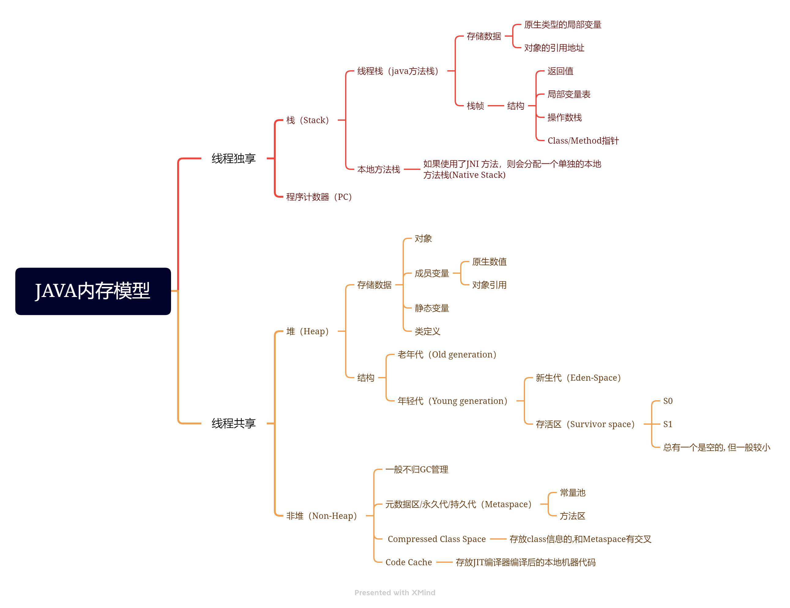
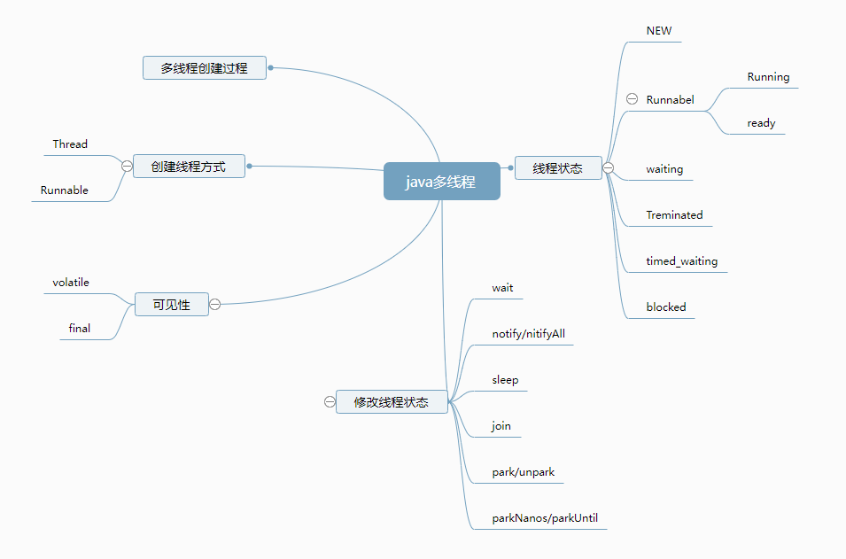
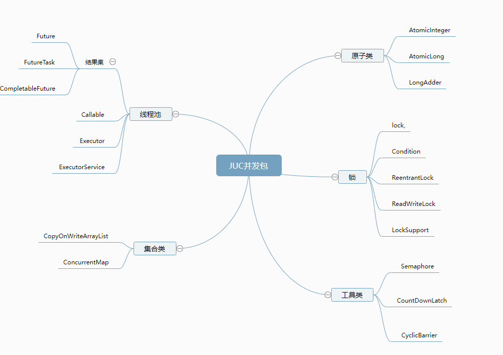

1.（必做）分别用 100 个字以上的一段话，加上一幅图（架构图或脑图），总结自己
对下列技术的关键点思考和经验认识:
JVM
NIO
并发编程
Spring 和 ORM 等框架
MySQL 数据库和 SQL
分库分表
RPC 和微服务
分布式缓存
分布式消息队列
要求提交毕业项目 + 毕业总结，毕业总结写在 README 文件里即可。
以上作业，要求 1 道必做题目提交到 GitHub 上面，毕业项目作业提交地址：

##毕业总结：

###毕业感言：
经过java进阶训练营五个月的训练，加强了常用技术的学习和练习巩固，每周上班都挺忙的，但是都会抽空去把每周的视频看完，合理规划时间，
让我印象特别深刻的就是每周的作业题，有必做和选做以及挑战题，在做题的过程中，要学习某个技术，然后使用这个技术来完成作业，我个人完成时间总是很久，有时候也会卡住排查问题，
这也让我意识到自己的动手能力欠缺，知识面也不广导致做的比较慢，所以还是需要继续练习，不断的总结，提升自己，
很多技术在工作中并不是都有用到，但是学习持之以恒，不断总结和刻意练习，当使用到的时候可以马上发挥，最近也在准备找工作，这段时间下来学的知识感觉对即将进行的面试帮助挺大的

###JVM：
- JVM内存模型：JVM需要使用计算机的内存，Java 程序运行中所处理的对象或者算法都会使用JVM的内存空间，JVM将内存区划分为5块，这样的结构称之为 JVM 内存模型。
- GC收集器主要解决java程序动态收集垃圾，解决内存容量的问题，常见的gc收集器有 串行，并行，CMS，G1，ZGC，java11开始支持G1，根据业务场景，如果要求高吞吐，选择并行gc，如果要求高吞吐也低延迟选择g1gc
- JAVA内存模型脑图：

###NIO
- 服务器通信原理为：建立链接，开始通信，结束通信，但在通信过程中，CPU 计算/业务处理，IO 操作与等待/网络、磁盘、数据库 等待过程中浪费了大量资源，所以有了物种IO模型的优化，其中Netty框架提供基于NIO支持海量并发，低延迟等特性
- 通信模型：
  - 同步异步 是通信模式
  - 阻塞、非阻塞 是 线程处理模式
- 五种IO模型
  - 阻塞式IO
  - 非阻塞式IO
  - IO复用
  - 信号驱动 I/O
  - 异步式 IO
- Netty

###并发编程
- java多线程主要是将系统资源的高效利用，提高效率完成指定任务，并发为单个线程同时接受大量请求，并行为不同线程同时处理各自的任务，在多线程写作的过程中会产生线程安全的问题，常见的锁有同步排他锁，乐观锁，自旋锁，
锁的力度应该尽量的小，减少资源的互斥，使用redision可以使用很多封装好的分布式锁工具，由于创建线程和销毁线程是一件非常耗费资源的事情，线程池能合理的使用资源，减少不必要的开销，同时能根据指定核心数，高性能完成指定任务
- java多线程脑图：

- JUC并发包脑图：

###Spring 和 ORM 等框架
- spring是一个一站式的轻量级的java开发框架，核心是控制反转（IOC）和面向切面（AOP），针对于开发的WEB层(springMvc)、业务层(Ioc)、持久层(jdbcTemplate)等都提供了多种配置解决方案；
- 为什么要使用spring？
  - 轻量：Spring框架可以在只有1MB多的JAR文件里发布。 
  - 控制反转(IOC): 促进松耦合，一个对象依赖的其它对象会通过被动的方式传递进来，而不是这个对象自己创建或者查找依赖对象
  - 面向切面(AOP): 允许通过分离应用的业务逻辑与系统级服务进行内聚性的开发。
  - 容器: Spring包含并管理应用对象的配置和生命周期。
  - 框架: Spring将简单的组件配置、组合成为复杂的应用，Spring也提供了很多基础功能（事务管理、持久化框架集成等等）。
- 微服务生态
  - springcloud
  - springboot
  - ....
- ORM：ORM（Object-Relational Mapping）表示对象关系映射，相关框架实现如：Hibernate，基于面向对象的语法使用上更加简单和高效，但特定复杂sql场景没有mybatis操作原生sql好用
- 总结，spring提供了一套轻量级的开发框架，帮助开发人员解决复杂的业务场景，更好的代码设计，衍生出了一套微服务框架springcloud体系，
这套体系下不同组件提供了不同微服务功能，让微服务下单个springboot应用更加高可用，能感知服务的健康状态

###MySQL 数据库和 SQL
- 关系型数据库设计五大范式
  - 第一范式（1NF）：关系 R 属于第一范式，当且仅当 R 中的每一个属性 A 的值域只包含原子项
  - 第二范式（2NF）：在满足 1NF 的基础上，消除非主属性对码的部分函数依赖
  - 第三范式（3NF）：在满足 2NF 的基础上，消除非主属性对码的传递函数依赖
  - BC 范式（BCNF）：在满足 3NF 的基础上，消除主属性对码的部分和传递函数依赖
  - 第四范式（4NF）：消除非平凡的多值依赖
  - 第五范式（5NF）：消除一些不合适的连接依赖
- mysql是关系型数据库，SQL 作为关系数据库管理系统的标准语言，只要不是关系型数据库，sql语言就不是必须的
- SQL语言
  - 数据查询语言（DQL: Data Query Language）
  - 数据操作语言（DML：Data Manipulation Language）
  - 事务控制语言（TCL）
  - 数据控制语言（DCL）
  - 数据定义语言（DDL）
  - 指针控制语言（CCL）
- mysql执行引擎和状态
- mysql的索引
- mysql事务
  - Atomicity: 原子性，一次事务中的操作要么全部成功，要么全部失败
  - Consistency: 一致性，跨表、跨行、跨事务，数据库始终保持一致状态
  - Isolation: 隔离性，可见性，保护事务不会互相干扰，包含4种隔离级别
  - •Durability: 持久性，事务提交成功后，不会丢数据。如电源故障，系统崩溃
- 总结：选择数据库需要注意存储引擎的区别，使用最优的数据库，日常开发中可以使用mysql作为关系型数据库的存储，需要注意sql的优化，
事务锁的力度应该尽量的小，合理设计表字段，当容量太大可考虑分库分表，数据同步或迁移和增量数据处理可使用binlog日志进行处理

###分库分表
- 为什么需要数据库拆分？ 
  - 主从结构解决了高可用，读扩展，但是单机容量不变，单机写性能无法解决
  - 在容量、性能、可用性无法满足业务需求的时候，需要拆分，提升容量-->分库分表，降低单个节点的写压力，提升整个系统的数据容量上限
- 扩展立方体：
  - X 轴：通过 clone 整个系统复制，集群，
  - Y 轴：通过解耦不同功能复制，业务拆分，
  - Z 轴：通过拆分不同数据扩展，数据分片
- 数据库拆分：
  - 垂直分库分表 => 分布式服务化 => 微服务架构，需要拆库拆表
  - 水平拆分（按主键分库分表）：水平拆分就是直接对数据进行分片，有分库和分表两个具体方式，但是都只是
    降低单个节点数据量，但不改变数据本身的结构。这样对业务系统本身的代码逻辑来说，就不需要做特别大的
    改动，甚至可以基于一些中间件做到透明
- 分库还是分表，如何选择：一般情况下，如果数据本身的读写压力较大，磁盘 IO 已经成为瓶颈，那么分库比分表要好。分库将数据分
  散到不同的数据库实例，使用不同的磁盘，从而可以并行提升整个集群的并行数据处理能力。相反的情况
  下，可以尽量多考虑分表，降低单表的数据量，从而减少单表操作的时间，同时也能在单个数据库上使用
  并行操作多个表来增加处理能力。
- 分库分表带来的容量和性能的提升，同时带来了分布式事务的问题，需要权衡
  - XA 分布式事务
  - BASE 柔性事务
    - TCC
    - SAGA
    - AT
    - 柔性事务的隔离级别
    - Seata-TCC/AT 柔性事务
- 常用框架有Apache ShardingSphere-JDBC
- 总结：当容量或者io瓶颈时可分库分表，业务上可以垂直拆分，容量上可以水平拆分，分库分表带来的分布式事务问题需要权衡考虑，
或者不使用分布式事务，在业务设计上尽量小粒度操作事务，避免分布式事务带来的性能损耗或代码侵入
###RPC 和微服务
- RPC 是远程过程调用（Remote Procedure Call）的缩写形式，将请求封装为代理，程序不需要代理的实现细节，共享相关实体和接口定义，
相关技术框架如FeignClient
- 微服务是将单个应用程序拆分成多个程序，网状式的进行访问，在微服务架构下， 提供了多个服务的
  - 注册和发现
  - 负载均衡，路由等集群功能
  - 熔断，限流等治理能力
  - 重试等策略
  - 高可能、监控、性能等等
- 微服务整体框架体系有springcloud和dubbo
###分布式缓存
- 缓存的本质是系统各级处理速度不匹配，导致利用空间换时间，缓存分为本地缓存，远程缓存，由于大多数应用都是微服务架构体系，使用本地缓存会加大jvm的gc频次，降低性能等，所以需要应用
远程缓存，常用的远程缓存有redis缓存
- 缓存使用场景：静态数据，准静态数据，热数据，读的频率远大于写的频率，命中率有百分治90以上
- 缓存过期策略：
  - 按FIFO或LRU
  - 按固定时间过期
  - 按业务时间加权：例如3+5x
- 缓存常见问题：
  - 缓存穿透：大量并发查询不存在的KEY，导致都直接将压力透传到数据库
  - 缓存击穿：某个KEY失效的时候，正好有大量并发请求访问这个KEY。
  - 缓存雪崩：当某一时刻发生大规模的缓存失效的情况，会有大量的请求进来直接打到数据库，导致数据库压力过大升值宕机。
- redis的5中基本数据结构
  - 字符串（string）
  - 散列（hash）- Map ~ Pojo Class
  - 列表（list）~ java 的 LinkedList
  - 集合（set）~ java 的 set，不重复的 list
  - 有序集合（sorted set）
- Redis 的3种高级数据结构
  - Bitmaps：setbit/getbit/bitop/bitcount/bitpos
  - Hyperloglogs：pfadd/pfcount/pfmerge
  - GEO：geoadd/geohash/geopos/geodist/georadius/georadiusbymember
- Redis 六大使用场景
  - 1.业务数据缓存
  - 2.业务数据处理
  - 3.全局一致计数
  - 4.高效统计计数
  - 5.发布订阅与 Stream
  - 6.分布式锁
- redis高可用
  - 简单主从模式
  - 哨兵模式
  - sintennil模式
###分布式消息队列
- MQ 的四大作用
  - 异步通信：异步通信，减少线程等待，特别是处理批量等大事务、耗时操作。
  - 系统解耦：系统不直接调用，降低依赖，特别是不在线也能保持通信最终完成。
  - 削峰平谷：压力大的时候，缓冲部分请求消息，类似于背压处理。
  - 可靠通信：提供多种消息模式、服务质量、顺序保障等。
- 消息处理模式
  - 点对点
  - 发布订阅
- 消息协议
  - STOMP 
  - JMS*
  - AMQP* 
  - MQTT*
  - XMPP 
  - Open Messaging
- 开源消息中间件/消息队列
  - 1、ActiveMQ/RabbitMQ
  - 2、Kafka/RocketMQ
  - 3、Apache Pulsar